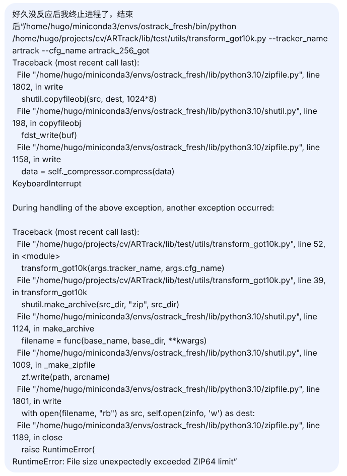

# ARTrack

## 测试结果


### ⚠️如果同名文件存在两个，file_origin是原始代码文件，file是可能修改文件


## zip报错（没有修改脚本，自己通过命令行压缩）



这个错误非常关键！它不仅解释了为什么脚本“没反应”，还指出了问题的根源——**脚本在最后尝试将整个结果目录压缩成 ZIP 文件，但由于文件总大小超过了 4GB 的 ZIP 格式传统限制，导致压缩过程卡住或失败**，而用户误以为卡死。

------

## 为什么会这样？

从错误堆栈的最后部分可以看到：

```python
shutil.make_archive(src_dir, "zip", src_dir)
```

这行代码位于脚本的末尾（第39行附近），意思是：

> 把转换完的所有结果文件（位于 `src_dir`）打包成一个 ZIP 压缩包，放在同一级目录。

- 你的测试结果文件可能很多（GOT-10k 有 180 个序列，每个文件可能包含数百帧的坐标），加起来总大小较大。
- 当压缩包超过 **4GB** 时，标准 ZIP 格式无法容纳（除非启用 ZIP64 扩展），而 Python 的 `shutil.make_archive` 默认**不一定自动启用 ZIP64**（在某些版本或环境下可能未正确处理），于是抛出了 `RuntimeError`。
- 压缩过程本身也消耗时间和 I/O 资源，且在压缩完成前脚本没有任何输出，所以你看到“没反应”。

------

## 解决办法（按推荐顺序）

### 方法一：禁止压缩（最快、最直接）

既然你已经有了转换后的文件，通常并不需要 ZIP 包（除非你要提交给官方评估服务器）。可以**直接注释掉压缩那一行**，让脚本只做格式转换，不做压缩。

编辑 `/home/hugo/projects/cv/ARTrack/lib/test/utils/transform_got10k.py`，找到类似下面这行（可能在函数末尾）：

```python
shutil.make_archive(src_dir, "zip", src_dir)
```

在它前面加上 `#` 注释掉，或者直接删除。保存后重新运行命令，这次会在几秒内完成。

**修改后的脚本示例**（只保留转换逻辑）：

```python
# 转换部分... (前面的代码不变)
# 最后去掉压缩
# shutil.make_archive(src_dir, "zip", src_dir)
```

------

### 方法二：启用 ZIP64 支持

如果你确实需要 ZIP 包，可以修改脚本，显式使用 `zipfile.ZipFile` 并启用 `allowZip64=True`。但这种方法相对复杂，且可能仍然因为文件数量过多（超过 65535 个文件）而失败。不推荐。

------

### 方法三：使用系统压缩工具（替代）

如果不想改脚本，也可以手动压缩。转换完成后（脚本不压缩），在终端执行：

```bash
cd /home/hugo/projects/cv/ARTrack/output/test/tracking_results/artrack/artrack_256_got/
zip -r got10k_submit.zip got10k_submit/
```

`zip` 命令默认支持 ZIP64，不会出错。

------

### 方法四：检查是否有不必要的文件被纳入压缩

有时 `src_dir` 可能包含了之前的旧结果或临时文件，导致文件夹过大。你可以先清理一下该目录，只保留必要的 `.txt` 结果文件。

------

## 补充说明：脚本到底在做什么？

完整流程如下：

1. 读取 `src_dir` 下的所有 `.txt` 文件（每个视频一个）。
2. 按 GOT-10k 官方评估格式转换（例如将坐标从 `[x,y,w,h]` 转为 `[x1,y1,x2,y2]` 等）。
3. **覆盖或写入新文件**（注意：可能直接修改原文件，也可能另存）。
4. **最后，将整个目录压缩成 ZIP 包**。

所以，现在你只需修改脚本去掉压缩步骤，就能很快完成转换，然后就可以使用 GOT-10k 官方工具进行性能评估了。

------

## 最终命令（修改脚本后）

```bash
/home/hugo/miniconda3/envs/ostrack_fresh/bin/python /home/hugo/projects/cv/ARTrack/lib/test/utils/transform_got10k.py --tracker_name artrack --cfg_name artrack_256_got
```

执行后将快速返回（无输出），转换结果就在原目录下。

## 模型权重

`mae_pretrain_vit_base.pth`文件放在`pretrained_models`目录下


